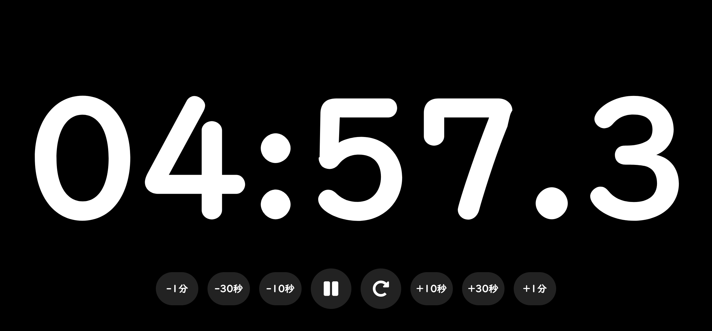

# big_timer

大画面表示のシンプルなカウントダウンタイマー(Android向けスタンドアロンアプリ)。

離れた場所からでも読める大きな数字表示と、鳴動時に確実に気づける強制音量アラームが特徴です。

## 特徴

- **大画面表示** — 縦画面・横画面どちらでも画面いっぱいに大きく残り時間を表示
- **確実に鳴らすアラーム** — タイマー完了時にアラーム音を再生し、端末のメディア音量を設定した音量まで自動で引き上げてから鳴らす(元の音量は停止時に復元)
- **ロック画面表示・画面常時点灯** — アラーム時計アプリと同じ仕組みで、ロック画面の上に表示され画面を点灯し続ける
- **時間の微調整** — 実行中・一時停止中に ±10秒 / ±30秒 / ±1分 でその場で調整可能
- **前回時間を記憶** — 次回起動時は前回設定した時間がデフォルトで入る
- **アラーム音量調整** — 設定画面でアラームの音量を個別に調整可能

## スクリーンショット

| 設定画面 | タイマー実行中(縦) |
| --- | --- |
|  |  |

| タイマー実行中(横) | アラーム音量設定 |
| --- | --- |
|  |  |

## 動作環境

- Android
- [Expo](https://expo.dev/) SDK 57 / React Native 0.86 で構築
- Android のメディア音量を直接操作するカスタムネイティブモジュール (`modules/volume-control`) を含むため、**Expo Go では動作しません**。EAS Build などによるスタンドアロンビルド、または `expo run:android` でのネイティブビルドが必要です。

## セットアップ

```bash
npm install

# 実機・エミュレータでネイティブビルドして起動
npx expo run:android
```

### スタンドアロンビルド (EAS Build)

```bash
npx eas-cli build --platform android --profile preview
```

ビルドが完了すると、インストール用のリンク(`https://expo.dev/artifacts/eas/....apk`)が発行されます。

設計の背景や各機能の意図は [ARCHITECTURE.md](./ARCHITECTURE.md) にまとめています。

## 技術構成

- [Expo](https://expo.dev/) / React Native / TypeScript
- [expo-audio](https://docs.expo.dev/versions/latest/sdk/audio/) — アラーム音の再生
- 自作 Expo Module (`modules/volume-control`) — Android のメディア音量(`AudioManager`)を直接制御するネイティブモジュール
- `expo-keep-awake` / `expo-navigation-bar` / カスタム Config Plugin (`plugins/withShowOverLockscreen.js`) — ロック画面上への表示・画面常時点灯

## ライセンス

[MIT License](./LICENSE)
